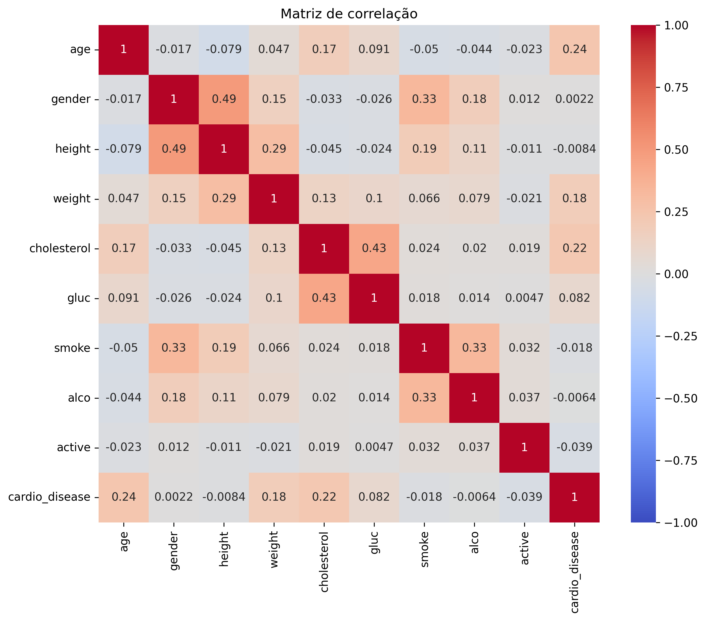
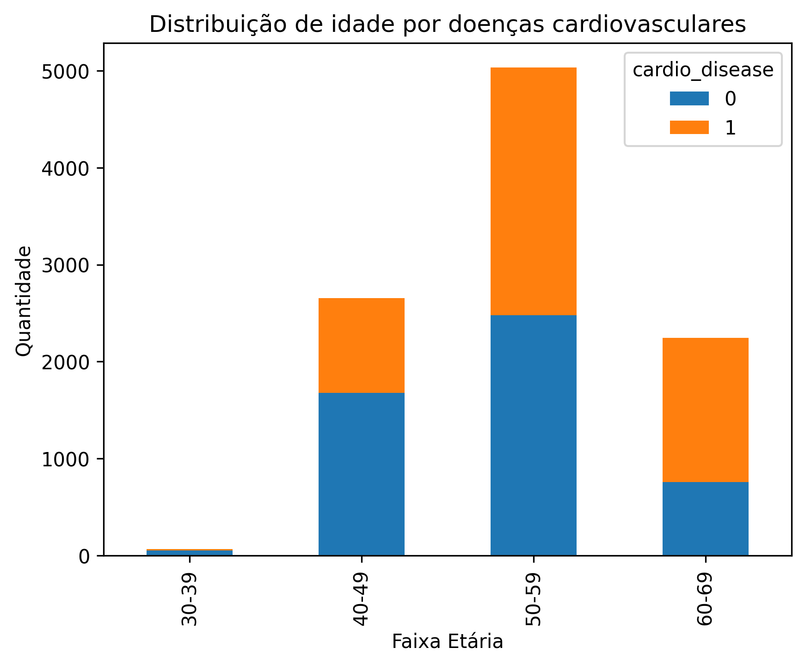
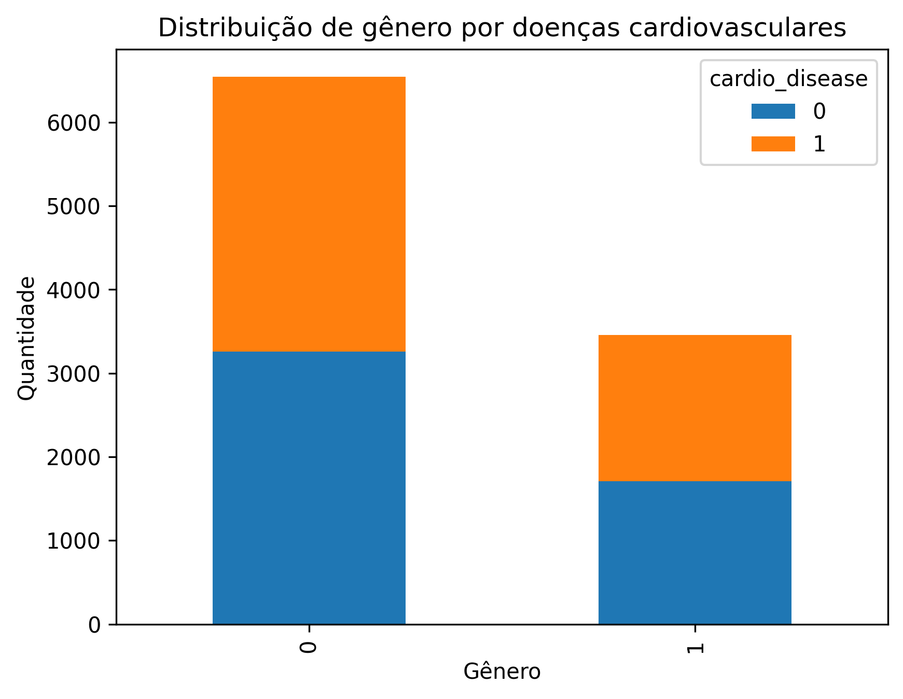
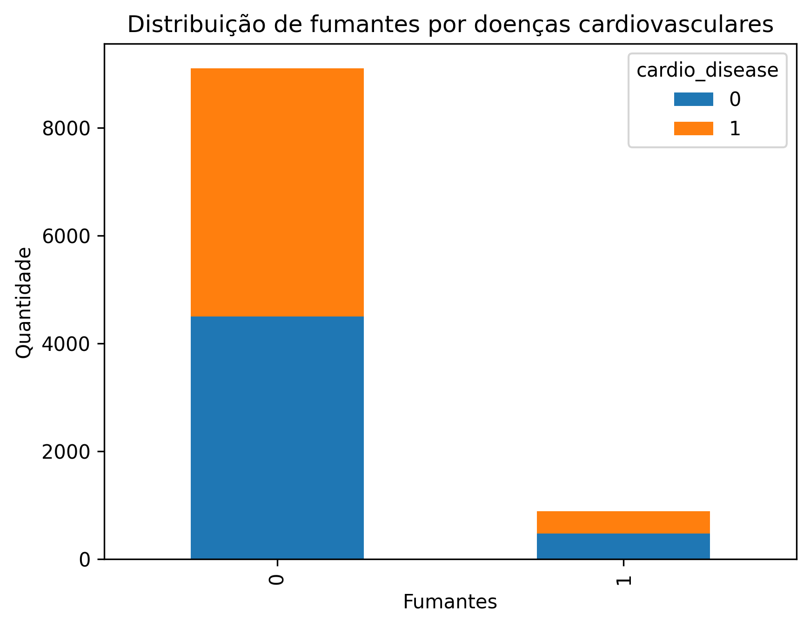
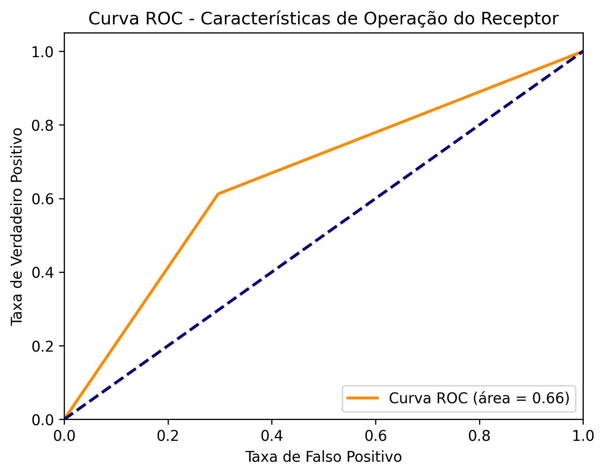

# Projeto de Regressão Logística - Doenças Cardiovasculares 🪀

Este projeto tem como objetivo aplicar técnicas de regressão logística para prever a presença de doenças cardiovasculares com base em dados de saúde de pacientes.

---

## 📌 Objetivo

Identificar fatores que influenciam o risco de doenças cardiovasculares e construir um modelo preditivo utilizando regressão logística. Foram realizadas análises exploratórias e visuais, além da construção e avaliação do modelo.

---

## 📊 Dicionário de Dados

| Coluna         | Descrição                                         |
|----------------|---------------------------------------------------|
| `age`          | Idade (em **anos**)                               |
| `gender`       | Gênero (1 = Feminino, 2 = Masculino)              |
| `height`       | Altura (em cm)                                    |
| `weight`       | Peso (em kg)                                      |
| `ap_hi`        | Pressão arterial sistólica                        |
| `ap_lo`        | Pressão arterial diastólica                       |
| `cholesterol`  | Nível de colesterol (1: normal, 2: acima, 3: muito acima do normal) |
| `gluc`         | Glicose (1: normal, 2: acima, 3: muito acima do normal) |
| `smoke`        | Fumante (0 = não, 1 = sim)                        |
| `alco`         | Consome álcool (0 = não, 1 = sim)                |
| `active`       | Pratica atividade física (0 = não, 1 = sim)       |
| `cardio_disease` | Possui doença cardiovascular (0 = não, 1 = sim) |

---

## 📈 Análises Gráficas

### 🔹 Matriz de Correlação


### 🔹 Distribuição por Faixa Etária


### 🔹 Distribuição por Gênero


### 🔹 Distribuição por Tabagismo


### 🔹 Curva ROC do Modelo


### 🔹 Visualização da Regressão


---

## 🧠 Conclusões

- A idade e os níveis de colesterol parecem estar mais correlacionados com doenças cardiovasculares.
- O modelo de regressão logística apresentou uma performance razoável, com AUC = 0.66.
- Gráficos como a curva ROC e a matriz de correlação ajudam a visualizar bem o desempenho e as relações entre variáveis.

---

## ⚙️ Como executar

1. Clone o repositório:
   ```bash
   git clone https://github.com/Sugaharaa/Projeto-Regressao-Logistica.git
   cd Projeto-Regressao-Logistica
   ```

2. Instale as dependências (recomenda-se usar um ambiente virtual):
   ```bash
   pip install -r requirements.txt
   ```

3. Execute o notebook:
   - `M27_Pratique.ipynb` (Jupyter Notebook)

4. Baixe o arquivo da base de dados utilizada:
   - [Download da base CARDIO_BASE.csv (Google Drive)](https://drive.google.com/file/d/1OR44D_e9CWrYcydupssbZDRuSUKgNrI2/view?usp=sharing)

---

## 🛠️ Tecnologias Utilizadas

- Python
- pandas, numpy
- matplotlib, seaborn
- scikit-learn
- Jupyter Notebook

---

## ✨ Autor

Projeto desenvolvido por [Sugaharaa](https://github.com/Sugaharaa)
